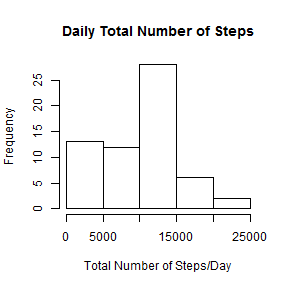
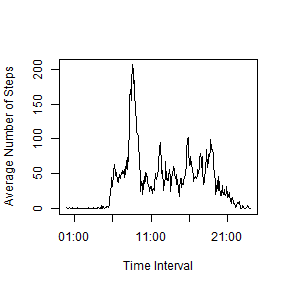
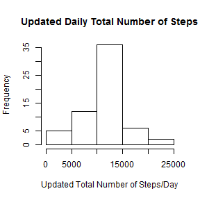
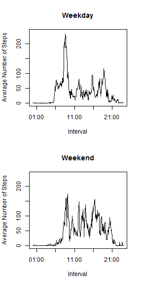

Reproducible Research: Peer Assessment 1
========================================
### Author: Linda Wang
### Version: 111215

## Loading and preprocessing the data
First load all the packages that will be used.
Make sure the unzipped dataset is in the working directory.
Preprocess the data by adding leading zeroes to "interval" elements, and make the column look "more like 'time values'".

```r
library(graphics)
library(stringr)
library(dplyr)
data <- read.csv("activity.csv")
data$interval <- str_pad(as.character(data$interval),4,pad="0")
date_and_time <- strptime(paste(data$date,data$interval),format="%Y-%m-%d %H%M")
data$date <- format(date_and_time,"%Y-%m-%d")
data$interval <- format(date_and_time,"%H:%M")
```
Preview the data a little bit.

```r
head(data)
```

```
##   steps       date interval
## 1    NA 2012-10-01    00:00
## 2    NA 2012-10-01    00:05
## 3    NA 2012-10-01    00:10
## 4    NA 2012-10-01    00:15
## 5    NA 2012-10-01    00:20
## 6    NA 2012-10-01    00:25
```

## What is mean total number of steps taken per day?
Ignore the missing values in the dataset for now. Use functions in package "dplyr".
Group the data by day, and then take the total number of steps per day (i.e. the "group total").
The following is a histogram of the total number of steps taken each day.

```r
day_grouped <- group_by(data,date)
day_sum <- summarize(day_grouped,total=sum(steps,na.rm=TRUE))
hist(day_sum$total,plot = TRUE,
     xlab="Total Number of Steps/Day",ylab="Frequency",main="Daily Total Number of Steps")
```

 

```r
mean(day_sum$total)
```

```
## [1] 9354.23
```

```r
median(day_sum$total)
```

```
## [1] 10395
```
And the mean of the total number of steps taken per day is 9354.23; the median is 10395.

## What is the average daily activity pattern?
Ignore the missing values in the dataset for now. Use functions in package "dplyr".
Group the data by interval, and then take the average number of steps of each interval across all days (i.e. the "group average").
The following is a time series plot of the 5-minute interval and the average number of steps taken, averaged across all days.

```r
minute_grouped <- group_by(data,interval)
minute_avg <- summarize(minute_grouped,avg=mean(steps,na.rm=TRUE))
plot(strptime(minute_avg$interval,format="%H:%M"),minute_avg$avg,
     type="l",xlab="Time Interval",ylab="Average Number of Steps")
```

 

```r
row_with_maxavg <- filter(minute_avg,avg==max(avg))
row_with_maxavg$interval
```

```
## [1] "08:35"
```
So the maximum number of steps, on average across all the days in the dataset, occurs in the 08:35 interval.

## Imputing missing values
To impute missing values, generate a new dataset by filling it with the original data first, and group the data by time interval, then mutate its "steps" column with the strategy: if a steps value is missing, replace it with the group average based on intervals; if it is not missing, then keep the steps value as it is.
After completing the filled dataset, group it by date, and take the group sum with functions in package "dplyr".
The following is the histogram of the (updated) total number of steps taken each day.

```r
nrow(data)-sum(complete.cases(data))
```

```
## [1] 2304
```

```r
filled_data <- data
filled_data <- filled_data %>% group_by(interval) %>% 
  mutate(steps=ifelse(is.na(steps),mean(steps,na.rm=TRUE),steps))

day_grouped_2 <- group_by(filled_data,date)
day_sum_2 <- summarize(day_grouped_2,total_2=sum(steps))
hist(day_sum_2$total_2,plot = TRUE,
     xlab="Updated Total Number of Steps/Day",ylab="Frequency",main="Updated Daily Total Number of Steps")
```

 

```r
mean(day_sum_2$total_2)
```

```
## [1] 10766.19
```

```r
median(day_sum_2$total_2)
```

```
## [1] 10766.19
```
There are 2304 missing values in the dataset. And the (updated) mean total number of steps taken per day is 10766.19, and the (updated) median is 10766.19, both of which are different from the estimates from the first part of the assignment. Here are the two summaries:

```
##      date               total      
##  Length:61          Min.   :    0  
##  Class :character   1st Qu.: 6778  
##  Mode  :character   Median :10395  
##                     Mean   : 9354  
##                     3rd Qu.:12811  
##                     Max.   :21194
```

```
##      date              total_2     
##  Length:61          Min.   :   41  
##  Class :character   1st Qu.: 9819  
##  Mode  :character   Median :10766  
##                     Mean   :10766  
##                     3rd Qu.:12811  
##                     Max.   :21194
```
Imputing missing data with interval averages has "lifted the lower tail" of the data, so the skewness is reduced, and values are more "clustered toward the center".

## Are there differences in activity patterns between weekdays and weekends?
For this part, the original (not the imputed) data is used. Use functions in package "dplyr".
First create a factor variable in the dataset with two levels - "weekday" and "weekend" indicating whether a given date is a weekday or weekend day, and mutate the dataset with a new "wkd" column by attaching the factor vector.
Group the mutated data by wkd and then by interval, then take the group averages based on these two criteria.
The following is a panel time series plot to compare the weekday-weekend patterns.

```r
data$date <- as.Date(data$date,format="%Y-%m-%d")
wkd_vec <- weekdays(data$date,abbreviate=TRUE)
wkdays <- c("Mon","Tue","Wed","Thu","Fri")
wkd_factor <- factor((wkd_vec %in% wkdays),levels=c(TRUE,FALSE),labels=c("weekday","weekend"))
data <- mutate(data,wkd=wkd_factor)
wkd_grouped <- group_by(data,wkd,interval)
minute_avg_2 <- summarize(wkd_grouped,avg_2=mean(steps,na.rm=TRUE))

par(mfcol=c(2,1))
plot(strptime(minute_avg_2$interval[minute_avg_2$wkd=="weekday"],format="%H:%M"),minute_avg_2$avg_2[minute_avg_2$wkd=="weekday"],
     type="l",xlab="Interval",ylab="Average Number of Steps",main="Weekday",ylim=c(0,240))
plot(strptime(minute_avg_2$interval[minute_avg_2$wkd=="weekend"],format="%H:%M"),minute_avg_2$avg_2[minute_avg_2$wkd=="weekend"],
     type="l",xlab="Interval",ylab="Average Number of Steps",main="Weekend",ylim=c(0,240))
```

 
